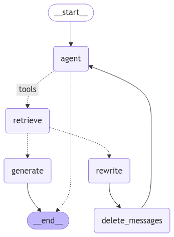

# Multi-agent Self-Reflective RAG with LangGraph

This repository contains intellectual property (IP) demonstrating the use of **LangGraph** to develop and orchestrate multi-agent systems. Each agent utilizes specialized tools to perform complex tasks. Specifically, this IP provides a concrete example of implementing the **Self-Reflective Retrieval-Augmented Generation (Self-RAG)** pattern, as detailed by LangChain ([blog.langchain.dev](https://blog.langchain.dev/agentic-rag-with-langgraph/?utm_source=chatgpt.com)).

## Prerequisites

Before using this repository, ensure you have the following:

- **Azure OpenAI Resource**: Endpoint URL and API key.
- **GPT-4o Model Deployment**: GPT-4o model deployed with standard deployment in your Azure OpenAI resource. Note the deployment name for configuration.
- **VS Code**: Visual Studio Code installed.

## Agentic Application Overview

This repository provides an example agent designed to handle user queries specifically about Lilian Weng's research on **Large Language Models (LLMs)**. The agent uses dedicated tools and state-management techniques to retrieve relevant documents and refine queries, significantly improving response accuracy and relevance.

### Components

The application features two primary components:

- **`retrieve` Tool**: Fetches relevant content from an external vector store based on provided metadata.
- **`rewrite` Agent**: Refines user queries as needed to align them closely with available content and application goals. After rewriting, the agent resets its internal message state, prompting fresh retrieval based solely on the refined query.

## Running the Self-Reflective RAG Example

### Execution via Jupyter Notebook

1. Open the notebook file: `self-reflective_rag.ipynb`.
2. Execute notebook cells sequentially. When prompted, enter your Azure OpenAI API key via an interactive pop-up in VS Code.  
   Each notebook section explains the implementation and logic behind the Self-RAG pattern using LangGraph.

## Additional Resources

For a detailed walkthrough of the Self-RAG pattern implementation with LangGraph, refer to:

- [Adaptive RAG with Self-Reflection: Part-1](https://www.youtube.com/watch?v=8UZCmQ8hP9c&utm_source=chatgpt.com)